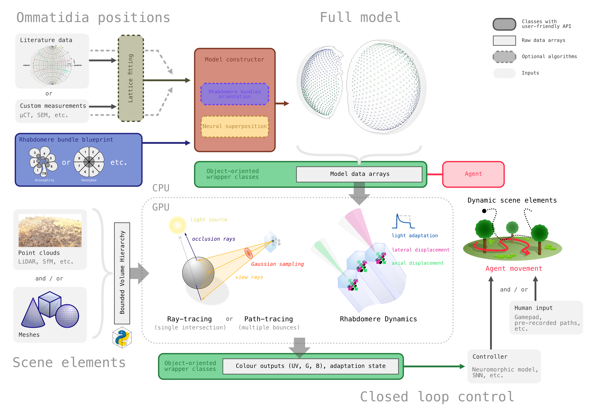
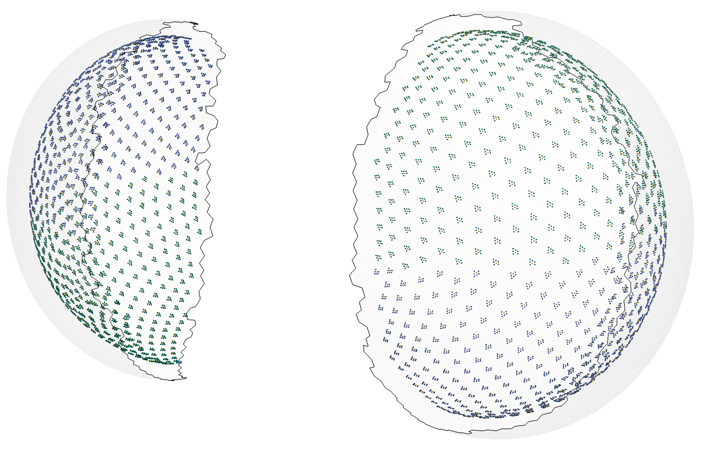
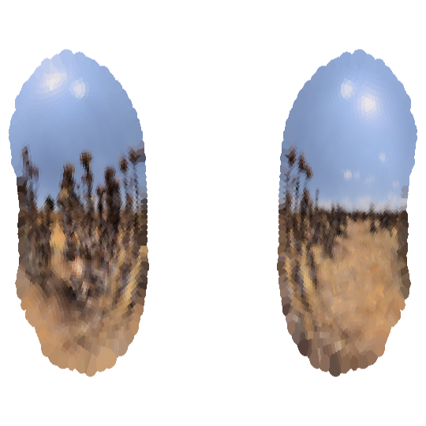
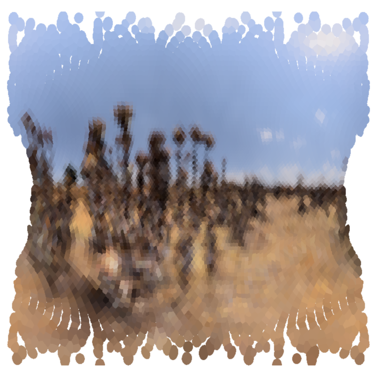
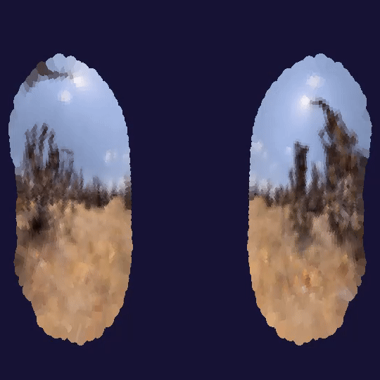

# RhabdoForge

`RhabdoForge` is a high-performance, biologically constrained rendering engine designed for the simulation of compound eye optics and the study of insect visual processing. 

<p float="left">
    
</p>

The framework enables researchers to model species-specific ommatidial arrays, rhabdomere bundle geometries, neural superposition wiring, etc. It integrates photomechanical dynamics (microsaccades and adaptation) into GPU-accelerated rendering pipelines, including ray-casting and path-tracing.

[](https://opensource.org/licenses/MIT)  

## Some features

*   **Biologically constrained eye models:** Procedural generation of compound eyes based on empirical data, including interommatidial angles (IOA), Snyder-based acceptance angles, and much more.
*   **Rhabdomere bundle modeling:** Support for complex rhabdomere arrangements with specific spectral sensitivities, focal plane offsets, alignment, etc.
*   **Neural superposition:** Automated wiring of lamina cartridges based on lattice topology.
*   **Photomechanical dynamics:** Simulation of rhabdomere microsaccades driven by luminance, membrane RC integration times, etc.
*   **Hybrid rendering pipelines:** Choice between ray-casting/path-tracing, with lots of control over the sampling methods.

## Installation

This project utilizes `uv` for Python dependency management. To set up the environment and install the required dependencies:

```bash
# Install dependencies
uv sync

# Activate the environment
source .venv/bin/activate  # on Windows: .venv\Scripts\activate
```

*Note: A GPU supporting OpenGL 4.3+ is required for the Compute Shader-based rendering pipelines, so no macOS support, sorry*

**Troubleshoot:** If the `pytinybvh` dependency fails to install on your machine with this error: `error: external filter 'git-lfs filter-process' failed`
then you can define the `GIT_LFS_SKIP_SMUDGE` environment variable (`$env:GIT_LFS_SKIP_SMUDGE=1` on Windows, or `export GIT_LFS_SKIP_SMUDGE=1` on Linux), and then run `uv sync` again.

## Usage Examples

### 1. Initialising a Compound Eye Model
The following snippet demonstrates loading a specific species model and configuring its biological parameters.

```python
from rhabdoforge.compound_eyes import Model
from rhabdoforge.compound_eyes.rhabdomeres import drosophila_bundle

# Load a Drosophila model with a custom rhabdomere bundle
model = Model.from_file(
    'assets/drosophila_scaffold.npz',
    bundle=drosophila_bundle()
)

# Apply spatial scaling (conversion to meters)
model.scale(1e-6)

# Configure photomechanical gains
model.ommatidia.ampl_lat_um = 1.5  # Lateral displacement in microns
model.ommatidia.ampl_ax_um = 8.0  # Axial contraction
```

### 2. Setting up a Scene
`RhabdoForge` uses a scene-instance architecture. Assets are baked into a BVH (Bounding Volume Hierarchy) for efficient GPU intersection.

```python
from rhabdoforge.engine import Context, Agent, Scene, Asset
from rhabdoforge.renderers import Renderer

# The context always has to be the first thing you create
context = Context()

scene = Scene(background_color=(0.1, 0.1, 0.1))

# Load environment geometry
your_asset = Asset.from_file(name='some name', file_path='assets/some_asset.obj')
scene.add_instance(asset=your_asset, transform=(0.0, 0.0, 5.0))

# Initialise the agent (the insect)
agent = Agent(position=(0.0, 0.0, 0.0))

# Initialise the renderer
renderer = Renderer(
    model=model,
    scene=scene,
    agent=agent,
    nb_samples=128  # Monte-Carlo samples per rhabdomere
)

# [run your loop... (see examples below)]

# Always cleanup to release GPU resources and reset global context
context.free()
```

### 3. Running a simulation
In closed-loop simulations (sync mode), the rendering loop updates both the position of the agent, the internal state of its sensors, and the scene geometry.

You can run in interactive mode, using a controller or mouse and keyboard inputs:
```python
# Interactive mode
while context.run_interactive(use_dashboard=True): # dashboard is an optional secondary window with settings, plots, etc
    context.input()     # processes inputs from keyboard / gamepad etc

    agent.translate(agent.forward * 0.5 * context.dt)
    output = renderer.step()

    context.display()      # displays to the screen
```

Headless mode:

```python
# Headless mode
all_data = []
for dt in context.run_headless(steps=1000):
    agent.translate(agent.forward * 0.5 * dt)
    output = renderer.step()
    if output: 
        all_data.append(output)

# Grab the final partial batch (if running in async, when renderer created with batch_size > 1)
final_batch = renderer.flush()
if final_batch:
    all_data.append(final_batch)
```

You can also have the renderer do the data concatenation for you:
```python
# Initialise with history tracking ON
renderer = Renderer(model, scene, agent, batch_size=100, track_history=True)

# Run the loop (no need to capture return values)
for dt in context.run_headless(steps=1000):
    agent.translate(agent.forward * 0.5 * dt)
    renderer.step()

# And then just ask for the data
dataset = renderer.history
```

You can also run defer timing completely to your calling loop, either by passing the `dt` to `renderer.step()`:
```python
dt = 1/100.0

for _ in range(1000):
    agent.translate(agent.forward * 0.5 * dt)
    output = renderer.step(dt)
```

...or by ticking the clock explicitely:
```python
for i in range(1000):

    dt = context.tick()

    agent.translate(agent.forward * 0.5 * dt)
    output = renderer.step()
```

Note: the Context object can also be used as a temporary one:
```python
with Context() as context:
    renderer = Renderer(model, scene, agent)
    while context.run_interactive():
        context.input()
        renderer.step()
        context.display()

# automatically cleaned up when 'with' block exits
```

### 4. Advanced usage

See included scripts in the `examples` folder for more examples and more functionality.

_______

## Screenshots

#### Full model example (_Drosophila melanogaster_)

Result of the procedural generator. Ommatidia lattice is shown as a transluscent sheet, rhabdomere tips are shown as dots.
Yellow rhabdomeres correspond to R7/8 (central), others are coloured green or blue depending on the bundle's chirality.
<p float="left">
    
</p>

#### First person views in the Seville LiDAR dataset

First-person view examples of a honeybee agent flying through the point cloud of the Seville dataset from [Habitat3D](https://insectvision.dlr.de/3d-reconstruction-tools/habitat3d), shown in two different projection modes.
<p float="left">
    
    
    
</p>

_______

### Paper

Pre-print available soon on bioRxiv.

### Acknowledgements

This work was funded by the UK Research & Innovation Engineering and Physical Sciences Research Council (grant numbers: EP/V008102/1 and EP/X019632/1).
The funders had no role in study design, data collection and analysis, decision to publish, or preparation of the manuscript.
UK Research & Innovation: https://www.ukri.org/.

### License

This project is licensed under the MIT License. See the LICENSE file for details.

_______

Powered by [PyTinyBVH](https://github.com/FlorentLM/PyTinyBVH)
<a href="https://github.com/FlorentLM/pytinybvh">

</a>

